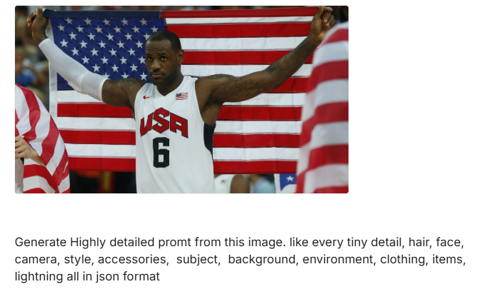
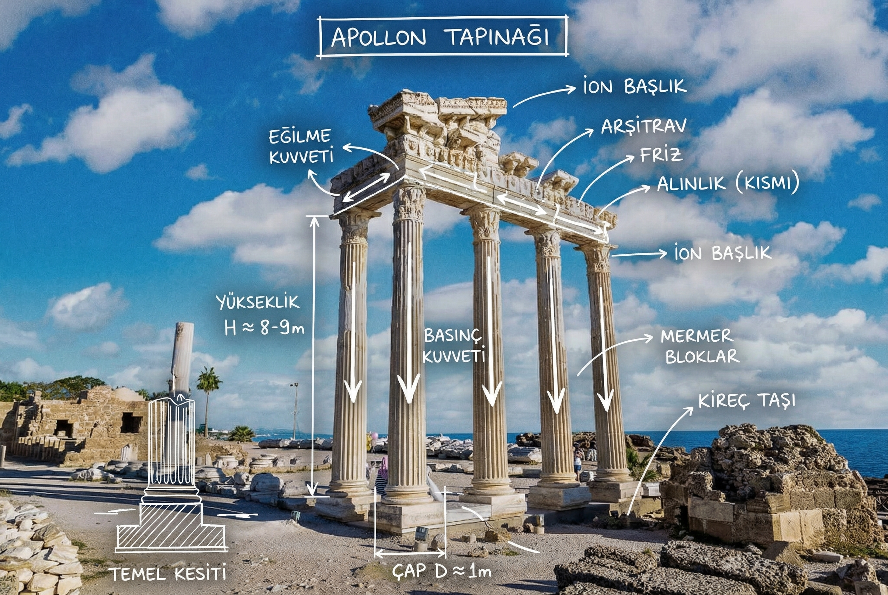
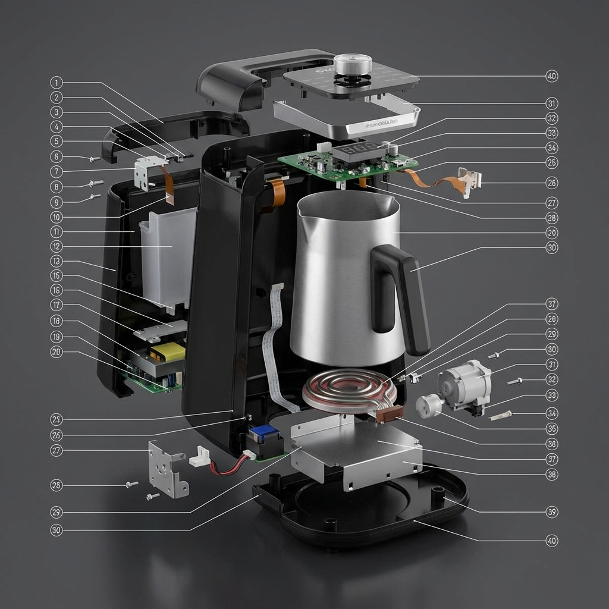
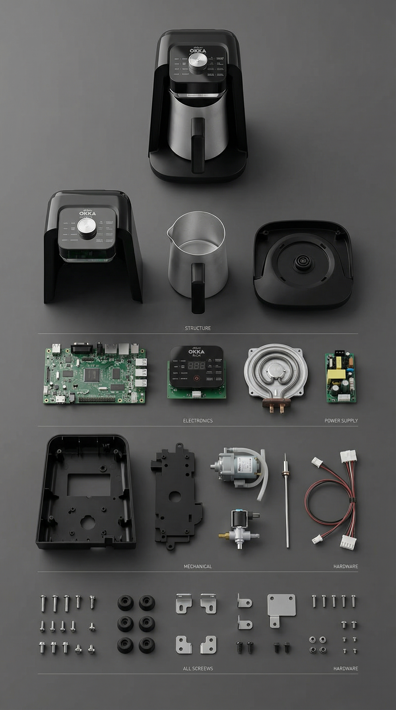
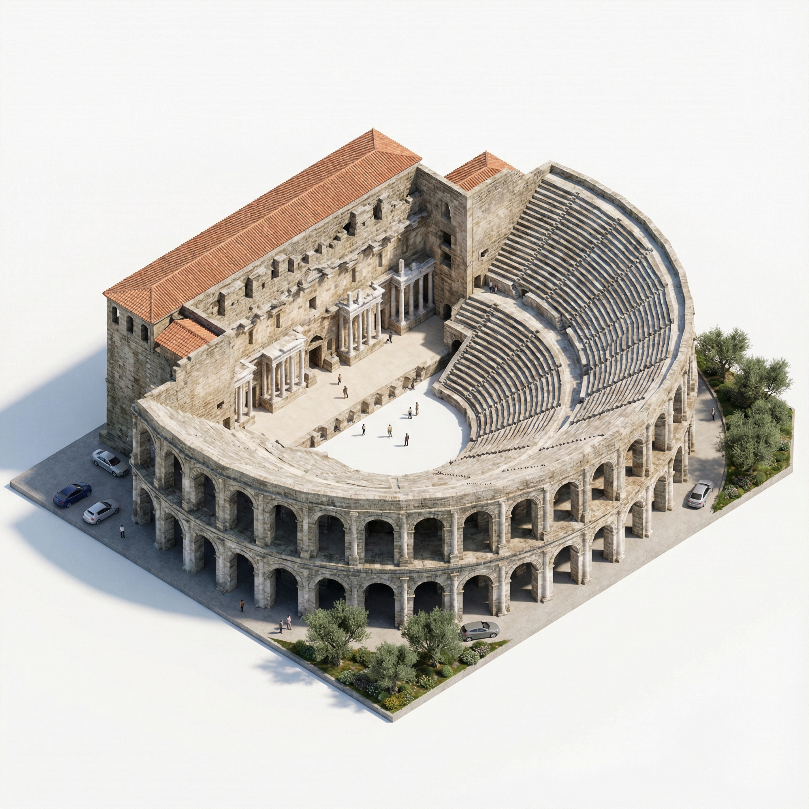
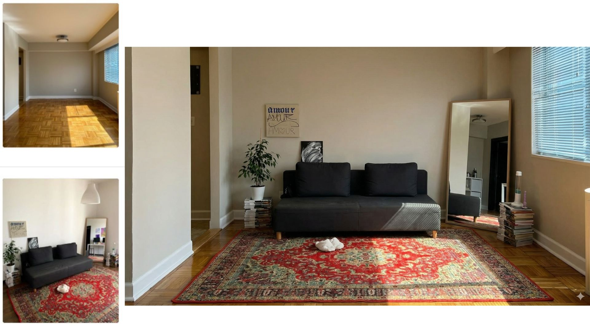

# promptlar

## Prompt Yaratma

```html
Generate Highly detailed promt from this image. like every tiny detail, hair, face,  camera, style, accessories,  subject,  background, environment, clothing, items, lightning all in json format
```

### ***Yaratılan Prompt’ta Değişiklik Yapma***

Örnek olarak Lebron James’in bu fotoğrafının promptunu çıkarttım.



```json
{
"subject": {
"identity": "LeBron James",
"role": "Professional Basketball Player",
"team": "Team USA Men's National Team",
"pose": "Standing facing forward, arms outstretched horizontally to the sides holding a flag behind his back, creating a wing-span effect.",
"expression": "Serious, focused, intense gaze, lips pressed together, looking slightly off-camera to the left."
},
"physical_features": {
"skin_tone": "Dark brown, with a visible sheen of sweat indicating athletic exertion.",
"hair": "Very short buzz cut, dark black, slightly receding hairline.",
"facial_hair": "Well-groomed goatee and mustache, light stubble along the jawline.",
"body_type": "Muscular, athletic build, defined deltoids and biceps.",
"tattoos": "Visible black ink script tattoos on the inner left bicep (reading 'Echoes of Eternity' in cursive script) and right shoulder/arm."
},
"clothing": {
"upper_body": "White Nike Team USA basketball jersey.",
"details": {
"chest_text": "Large red 'USA' block letters with navy blue outline.",
"number": "Large navy blue number '6' centered below the text.",
"logos": "Red Nike swoosh on the right upper chest, small American flag patch on the left upper shoulder strap.",
"material": "Breathable sports mesh fabric."
}
},
"accessories": {
"right_arm": "White compression sleeve covering the entire arm from bicep to wrist.",
"left_arm": "No sleeve, bare skin with visible tattoos."
},
"items": {
"primary_prop": "A large United States flag (Stars and Stripes).",
"prop_details": "Held taut horizontally behind the subject's upper back and shoulders. The blue field with stars is on the viewer's left. The subject is gripping the top corners of the flag with his hands.",
"surrounding_items": "Partial view of another US flag draped over someone's shoulder in the blurry foreground on the left and right edges."
},
"background": {
"setting": "Indoor sports arena or stadium.",
"environment": "Crowded but out of focus (bokeh).",
"elements": "Blurred figures in the background, hints of blue seating or clothing, suggesting a spectator area."
},
"lighting": {
"type": "Professional stadium floodlighting.",
"quality": "Bright, diffused, neutral temperature.",
"highlights": "Soft specular highlights on the subject's forehead, shoulders, and nose due to perspiration.",
"shadows": "Minimal, soft shadows under the chin and facial features."
},
"camera": {
"shot_type": "Medium shot (waist up).",
"angle": "Eye-level.",
"focus": "Sharp focus on the subject's face and jersey.",
"depth_of_field": "Shallow (bokeh effect), blurring the background to isolate the subject.",
"lens_characteristics": "Telephoto lens compression typical of sports photography."
},
"style": {
"aesthetic": "Iconic sports photography, patriotic, high-resolution, journalistic.",
"mood": "Triumphant, serious, determined, legendary."
}
}

```

---

Orijinal prompt’taki kodda USA bayrağı var.

```json
"primary_prop": "A large United States flag (Stars and Stripes).",
"prop_details": "Held taut horizontally behind the subject's upper back and shoulders. The blue field with stars is on the viewer's left. The subject is gripping the top corners of the flag with his hands.",
"surrounding_items": "Partial view of another US flag draped over someone's shoulder in the blurry foreground on the left and right edges."
```

Prompt’taki kodları Türk bayrağına dönüştürdüm.

```json
"primary_prop": "A large Turkish Flag.",
"prop_details": "Held taut horizontally behind the subject's upper back and shoulders. The crescent is on the viewer's left. The subject is gripping the top corners of the flag with his hands.",
"surrounding_items": "Partial view of another Turkish flag draped over someone's shoulder in the blurry foreground on the left and right edges."
```

Orijinal Prompt’taki Giysi Kodları

```json
"clothing": {
"upper_body": "White Nike Team USA basketball jersey.",
"details": {
"chest_text": "Large red 'USA' block letters with navy blue outline.",
"number": "Large navy blue number '6' centered below the text.",
"logos": "Red Nike swoosh on the right upper chest, small American flag patch on the left upper shoulder strap.",
"material": "Breathable sports mesh fabric."
```

Türkiye’ye uyarladım:

```json
"clothing": {
"upper_body": "White Nike Team Türkiye basketball jersey.",
"details": {
"chest_text": "Large red 'TUR' block letters with navy blue outline.",
"number": "Large red blue number '6' centered below the text.",
"logos": "Red Nike swoosh on the right upper chest, small Turkish flag patch on the left upper shoulder strap.",
"material": "Breathable sports mesh fabric."
```

## Çıktı:


Bu sefer orijinal prompt’taki clothing kısmına [uploaded image] yazıp Fenerbahçe forması görseli koyuyorum.

```json
"clothing": {
"upper_body":  [uploaded image],
"details": {
"material": "Breathable sports mesh fabric."
```


## Çıktı:


# 1. Google Maps Fotoğrafı

```html
"Show a screenshot from Google Maps with an image of this place with a photo and its coordinates"
```

[https://pbs.twimg.com/media/G6SzMpVawAAhhLI?format=jpg&name=900x900](https://pbs.twimg.com/media/G6SzMpVawAAhhLI?format=jpg&name=900x900)

# 2. Sims 4 Karakter Yaratma

```html
"Make her the sims character that is currently editing on the Create-a-Sim charactor creation in Sims 4"
```

[https://pbs.twimg.com/media/G6SvOQ1bIAEUDU9?format=jpg&name=large](https://pbs.twimg.com/media/G6SvOQ1bIAEUDU9?format=jpg&name=large)

# 3. Holografik Sticker

```html
"Make a iPhone shot of old 2000s holographic glitter sticker of this person without background, and it's placed on a street pole"
```


# 4. Mimari Teknik Bilgi Grafiği

```json
"Create an infographic image of [LANDMARK], combining a real photograph of the landmark with blueprint-style technical annotations and diagrams overlaid on the image. Include the title "[LANDMARK]" in a hand-drawn box in the corner. Add white chalk-style sketches showing key structural data, important measurements, material quantities, internal diagrams, load-flow arrows, cross-sections, floor plans, and notable architectural or engineering features. Style: blueprint aesthetic with white line drawings on the photograph, technical/architectural annotation style, educational infographic feel, with the real environment visible behind the annotations"
```


# 5. MS Paint Ekran Görüntüsü

```html
"The photo of the screen of old computer taken with iphone. The computer screen has the screenshot displays the Microsoft Paint application with a pink-themed window border with toollbox containing icons and inside o the border is 2d version of the person in this photo" 
```


# 6. Yemek Malzemeleri Fotoğrafı

```html
"Show me a photo of all the ingredients for this dish, labeled with names and quantities."
```


# 7. Profesör Beyaz Tahtası

```html
Take this paper and transform in the image of a professor whiteboard image: diagrams, arrows, boxes, and captions explaing the core idea visually. Use colors as well
```


# 8. Mühendislik Açıklamalı Anıt

```html
Add clean white hand-drawn engineering annotations over the uploaded image. Insert the monument name at the top in a handwritten title box "name of monument ". Draw simple technical sketches and labels around the photo, such as arrows pointing to key structural elements, dimensions, materials, forces (tension/compression), and cross-sections. Style the drawings like architectural chalk or pencil lines over the photo. Keep everything minimalistic, precise, and harmonious with the scene. 
```



# 9. Güvenlik Kamerası

```html
"I lost my bag somewhere in the Mission District in San Francisco, check the city's surveillance cameras to see where I last had it"
```


# 10. Kıyafet Parçaları - Asfalt Üzerinde

```html
"Give each piece of his clothing separately on the asphalt"
```


# 11. Trump Güvenlik Kamerası

```html
Donald Trump taking a selfie, as captured directly from a security camera monitor in an authentic New York City bodega. The image should look like a raw screenshot or photo of a CRT or LCD security monitor, displaying Trump's reflection as he takes the selfie. He should be holding a smartphone up. The security camera's wide-angle lens distortion should be evident, making the foreground slightly bulbous and the background receding. The bodega interior should be densely packed with brightly lit, colorful product shelves, giving a stark, almost surveillance-like feel. Include on-screen text overlays like 'RECORDING IN PROGRESS' or a similar security system message, and a subtle timestamp. The overall aesthetic should be high-contrast, slightly grainy, and reminiscent of a low-fidelity security feed.
```


# 12. Trump Photo Booth

```html
"A full-screen screenshot of a MacBook Photo Booth application, showing Donald Trump inside the webcam frame. He is on his private jet, looking directly at the camera with a slight, unpolished expression, as if caught mid-moment. The image inside the Photo Booth window should have the distinctive wide-angle lens distortion, slightly overexposed flash, and the muted, slightly green-tinted color cast characteristic of early 2000s webcams. Include the 'Photo Booth' title at the top of the window, the 'Photo Booth' pixelated text overlay, a date stamp like 'OCT 26 2006', and the familiar Photo Booth control buttons at the bottom. The background of the private jet interior should be visible behind him, slightly distorted by the lens effect."
```


# 13. Trump Kaykay

```html
Donald Trump skateboarding, captured with the exact, unmistakable aesthetic of a Sony VX1000 camcorder using a fisheye lens. The image should feature: Extreme wide-angle fisheye distortion, with prominent barrel distortion and a dark, rounded vignette around the edges, as seen in the reference images. Low-resolution, grainy video still quality, with visible interlacing artifacts and a slightly 'fuzzy' or soft feel, rather than sharp, clean detail. Washed-out, slightly desaturated, and often subtly greenish or yellowish color cast, typical of older video cameras. Colors should not be vibrant. Harsh, natural lighting, with bright areas (like the sky or sun reflections) often blown out or extremely bright, creating strong contrast. Visible lens flare or light leaks when the sun is in frame or at an angle, characteristic of the VX1000 lens. A feeling of motion and raw, unpolished energy, as if captured from a fast-moving, handheld perspective during a skate session. Trump should be performing a skate trick or mid-motion on a skateboard, positioned prominently within the distorted fisheye frame against an urban or public space background (like a plaza or street). No date stamps, camera UI, or digital overlays. The final image must instantly evoke the nostalgic, raw, and underground vibe of early 2000s skate videos shot on a VX1000.
```


# 14. Trump Özel Jet - Puro

```html
Donald Trump, sitting in a luxurious private jet, smoking a cigar. The image should be captured with flash photography on a Fujifilm 35mm film camera, exhibiting prominent film grain. The direct, slightly harsh flash lighting should create strong contrasts and highlights on Trump's face and the interior of the jet. The overall color palette should be muted and slightly desaturated with a subtle filmic warmth, and noticeable film grain should be a key textural element throughout the scene.
```


# 15. Trump White House

```html
"A photograph of Donald Trump standing outside the White House, smoking a cigar. The image must look EXACTLY like it was taken on an original iPhone 3G (late 2000s). Replicate these definitive visual traits: Low resolution (640x480 ratio), resulting in a soft, slightly blurry image lacking fine detail, but without excessive, blocky pixelation. Subtle, fine digital noise/grain, present across the entire image, giving it a slightly textured, but not overwhelmingly "dirty" appearance. Limited dynamic range characterized by: Slightly blown-out highlights e.g. that lose subtle detail. Elevated black levels in shadows crushed blacks that aren't truly black, with minimal detail. Distinctive color rendering: Slightly desaturated and muted colors overall, lacking vibrancy. A subtle, consistent color cast or sometimes a touch cool/greenish, which gives the entire image a specific 'tint'. Greens (grass) will appear duller, blues (sky) less vivid. Soft focus due to the fixed-focus lens: nothing in the image will be pin-sharp; there will be a general, gentle blur across the entire frame. Pronounced chromatic aberration (color fringing) visible as subtle color halos red/cyan around high-contrast edges, especially on the White House architecture or tree branches against the sky. A casual, slightly uncentered, point-and-shoot composition, characteristic of early smartphone photography. No date stamps, camera UI, or artificial lens flares. The overall impression must be unmistakably 'early iPhone snapshot,' conveying a sense of nostalgia for that specific mobile camera quality
```


# 16. 3D Tipografi Tasarımı

```html
A vibrant, eye-catching "TYPOGRAPHY" design on a textured off-white background. The letters are bold, blocky, extra condensed and create a 3D effect with overlapping layers of bright blue and hot pink, each with a halftone dot pattern, evoking a retro print aesthetic. 16:9 aspect ratio
```


# 17. Minimalist Logo Tasarımları

```html
Make 8 minimalistic logos, each is an expressive word, and make letters convey a message or sound visually to express the meaning of this word in a dramatic way. composition: flat vector rendering of all logos in black on a single white background
```


# 18. İmkansız Şekil - Impossible

```html
Word Impossible as impossible shape, 16:9, make 10 versions, one at a time, each it's own server call
```


# 19. Yemek Logoları

```html
Make 8 sophisticated minimalistic logos, each is a fun food word, and make letters from realistic food to express the meaning of this word. composition: a rendering of all logos on a single solid white background

```


# 20. Güneş Enerjisi Bilgi Grafiği

```html
High-quality flat lay photography creating a DIY infographic that simply explains how solar energy works, arranged on a clean, light gray textured background. The visual story flows from left to right in clear steps: Content is based on this: 
```


# 21. Bitki Bilgi Grafiği

```html
Create an infographic about this plant focusing on interesting information
```


# 22. Elaichi Chai İnfografik

```html
Create an infographic that shows how to make elaichi chai
```


# 23. Marka Mockup Görselleri

```html
Generate brand mockup images showing a logo applied to various products and contexts (tote bag, coffee cup, t-shirt, cap, poster, etc.)
```


# 24. Moodboard Stili

```html
"Generate an image in the style of this moodboard"
```


# 25. Hoparlör Teknik Çizimi

```html
"Create a technical drawing of this speaker"
```


# 26. Polaroid Fotoğraf - Y2K Stil

```html
Take a photo taken with  a  Polaroid camera. The photo should look like an ordinary photograph, without an explicit subject or property. The photo should have a slight blur and a consistent light source, like a flash from a dark room, scattered throughout the photo. Don't change the face. Make the clothes y2k baggy black style not formal but not sportive also
```


# 27. Karakter Figürü ve Kutusu

```html
turn this photo into a character figure. Behind it, place a box with the character's image printed on it, and a computer showing the Blender modeling process on its screen. In front of the box, add a round plastic base with the character figure standing on it. set the scene indoors if possible
```


# 28. AR Lokasyon Deneyimi

```html
you are a location-based AR experience generator. highlight [point of interest] in this image and annotate relevant information about it.
```


# 29. İzometrik Bina

```html
Make Image Daytime and Isometric [Building Only]
```


# 30. Kuşbakışı Görünüm - Fotoğrafçı Konumu

```html
Convert the photo to a top-down view and mark the location of the photographer.
```


# 31. Mermer Heykel

```html
A photorealistic image of an ultra-detailed sculpture of the subject in image made of shining marble. The sculpture should display smooth and reflective marble surface, emphasizing its luster and artistic craftsmanship. The design is elegant, highlighting the beauty and depth of marble. The lighting in the image should enhance the sculpture's contours and textures, creating a visually stunning and mesmerizing effect
```


# 32. Çok Açılı Görünüm

```html
Generate the Front, Rear, Left, Right, Top, Bottom views on white. Evenly spaced. Consistent subject. Isometric Perspective Equivalence. 
```


# 33. Theme Park Stili İzometrik

```html
Take this location and make the landmark an isometric image (building only), in the stvle of the game Theme Park
```


# 34. Spiral Defter Fotoğrafı

```html
"A square format (1:1 aspect ratio) top-down photograph capturing an entire spiral-bound notebook lying flat and centered on a plain white background. There is ample white space around all four sides. The notebook page has lined paper and a red margin line on the left. Written neatly in blue handwritten ink, the writing starts on the second line down from the top (leaving the very top lines blank). Furthermore, the writing starts slightly indented to the right of the red margin line, leaving natural padding space between the line and the text. The exact text is: 'YOUR TEXT HERE'. Soft lighting."
```


# 35. Hip-Hop Albüm Kapağı

```html
Authentic late 1990s / early 2000s hip-hop album cover, photographed look. Donald Trump in a confident, slightly menacing pose, wearing a dark suit, shot with a wide-angle lens, looking directly at the camera. He is positioned prominently in the foreground. Behind him, the White House is visible, shot from a slightly dramatic, low angle, with a dark, overcast, slightly ominous sky. The image has a gritty, high-contrast, slightly desaturated color palette, with deep shadows and strong highlights, typical of 90s photography. The album title, 'THE OVAL OFFICE', is rendered in large, impactful 3D chrome or metallic text, with a subtle bevel and glow, positioned across the top, looking like it's embossed or applied over the photograph. The artist name, 'DONALD J. TRUMP', is in a bold, blocky, slightly distressed sans-serif font, perhaps in a contrasting color or with a subtle drop shadow, at the bottom. The overall composition is dense and visually powerful, with a sense of raw, unpolished energy characteristic of classic hip-hop album art from that era. Square album cover format.
```


# 36. Sahne Arkası

```html
'Show me the exact backstage of this cinematic shot.'
```


# 37. Online Mağaza Sayfası

```html
"Make an online shop page for this watch"
```


# 38. Online Gardırop Katalogu

```html
"Make an online wardrobe catalog from this outfit"
```


# 39. Teknik İnfografik

```html
{
"promptDetails": {
"description": "Ultra-detailed exploded technical infographic of {OBJECT_NAME}, shown in a 3/4 front isometric view. The object is partially transparent and opened, with its key internal and external components separated and floating around the main body in a clean exploded-view layout. Show all major parts typical for {OBJECT_NAME}: outer shell/panels, structural frame, primary electronics/boards, power system/battery or PSU, ports/connectors, display or interface elements if present, input controls/buttons, mechanical modules (motors/gears/fans/hinges) if applicable, speakers/microphones if applicable, cables/flex ribbons, screws/brackets, and EMI/thermal shielding. Use thin white callout leader lines and numbered labels in a minimalist sans-serif font. Background: smooth dark gray studio backdrop. Lighting: soft, even, high-end product render lighting with subtle reflections. Style: photoreal 3D CAD render, industrial design presentation, high contrast, razor-sharp, 8K, clean composition, no clutter.",
"styleTags": [
"Exploded View",
"Technical Infographic",
"Photoreal 3D CAD Render",
"Industrial Design Presentation",
"Minimalist Labels",
"Dark Studio Background"
]
},
"negativePrompt": "no people, no messy layout, no extra components, no brand logos, no text blur, no cartoon, no low-poly, no watermark, no distorted perspective, no heavy noise",
"generationHints": {
"aspectRatio": "1:1",
"detailLevel": "ultra",
"stylization": "low-medium",
"camera": {
"angle": "3/4 front isometric",
"lens": "product render perspective"
},
"lighting": "soft even studio lighting, subtle reflections",
"background": "smooth dark gray seamless backdrop"
}
}
```



# 40. Tarihi Olay - Konum ve Tarih

```html
{
"meta": {
"mode": "thinking",
"use_search_grounding": true,
"language": "tr"
},
"input": {
"location": "KONUM",
"date": "YYYY-MM-DD",
"aspectRatio": "16:9 | 4:3 | 1:1 | 9:16",
"timeOfDay": "optional",
"mood": "optional: epic | solemn | celebratory | tense | melancholic"
},
"prompt": {
"positive": "Konum: KONUM\nTarih: YYYY-MM-DD\n\nÖnce güvenilir kaynaklarla arama yap ve bu tarihte bu konumda gerçekleşen en önemli tarihsel olayı belirle. Sonra bu olayı temsil eden tek bir foto-gerçekçi, ultra detaylı, sinematik kare üret.\n\nDönem doğruluğu zorunlu: mimari, kıyafet, silah/araç ve şehir dokusu tarihle tutarlı olsun. Modern hiçbir obje, bina, araç veya tabela görünmesin. Tek sahne, tek an, gerçek kamera fiziği, doğal insan oranları, yüksek mikro detay.",
"negative": "modern buildings, cars, asphalt, neon, smartphones, wrong era clothing/armor, fantasy, anime, cartoon, text overlay, blurry, low-res, extra limbs"
},
"render": {
"quality": "ultra",
}
}
```


# 41. Component Family Portrait

```html
{
"promptDetails": {
"description": "Ultra-clean component family portrait of {OBJECT_NAME}, laid out on a flat surface as a precise top-down grid. Place the fully assembled {OBJECT_NAME} in the center or near the top, and arrange all major components around it in a carefully aligned grid: outer shell pieces, frame/chassis, electronic boards, battery or power module, ports/connectors, mechanical parts (motors/gears/hinges) if applicable, cables/flex ribbons, and grouped screws/brackets. Use perfect alignment and equal spacing, with clear visual grouping into sections such as electronics, mechanical, and structure. Add very subtle minimalist label strips near each group with tiny sans-serif text, but keep the focus on the visual layout rather than the text. Background: neutral matte studio surface (dark gray or off-white). Lighting: soft top-down studio lighting with gentle shadows for depth, like a museum design teardown board. Style: photoreal 3D product teardown layout, high contrast, razor-sharp, 8K, extremely tidy and minimal, no clutter.",
"styleTags": [
"Component Family Portrait",
"Top-Down Grid Layout",
"Product Teardown",
"Photoreal 3D Render",
"Industrial Design Presentation",
"Minimalist Labels",
"Neutral Studio Background"
]
},
"negativePrompt": "no people, no messy layout, no overlapping parts, no extra unrelated objects, no brand logos, no text-heavy labels, no cartoon style, no low-poly, no watermark, no distorted perspective, no heavy noise",
"generationHints": {
"aspectRatio": "9:16",
"detailLevel": "ultra",
"stylization": "low-medium",
"camera": {
"angle": "top-down orthographic or near-orthographic view",
"lens": "product teardown / flat-lay photography perspective"
},
"lighting": "soft uniform top-down studio lighting with gentle shadows for separation",
"background": "neutral matte surface, dark gray or off-white, seamless and clean"
}
}
```



# 42. Spesifik Koordinat ve Tarih

```html
"Create an image at 31.7785° N, 35.2296° E, April 3, 33 CE, 15:00 hours."
```


# 43. İzometrik Mimari Render

```html
Create a highly detailed isometric 3D rendering of [LANDMARK] in architectural visualization style. The building is shown at a 45-degree angle from above, displaying three visible sides with intricate architectural detail. Photorealistic textures showing materials like stone, glass, metal, or brick. Include the base/ground level with tiny people, cars, and landscaping for scale. Clean white or light grey background. Professional architectural rendering with soft ambient shadows beneath the structure. Every window, column, ornamental detail, and structural element clearly visible. Centered composition. Style similar to video game building assets or architectural presentation models - clean, detailed, slightly stylized but realistic.
```



# 44. Dijital Kamera LCD Ekranı - Y2K Selfie

```json
Close-up, top-down shot of a black early 2000s compact digital camera resting on textured blue denim fabric. The rear LCD screen is illuminated, displaying a lo-fi, grainy, flash-lit selfie of a young woman. Subject on screen has dark wavy hair, heavy Y2K-style pink blush on cheeks and nose, winged eyeliner, and glossy lips, looking over her shoulder with a soft gaze. The camera body has visible buttons and a directional pad. Shallow depth of field with focus sharp on the LCD screen and slightly blurred edges.
```


## 45. Ultra Gerçekçi Konum Fotoğrafı

```json
{
"customInputs": {
"landmark": "{INSERT_LANDMARK_NAME}",
"aspectRatio": "{INSERT_ASPECT_RATIO}",
"timeOfDay": "{INSERT_TIME_OF_DAY}",
"weather": "{INSERT_WEATHER_CONDITION}"
}
"promptDetails": {
"description": "A completely real, ultra high resolution aerial photograph of {INSERT_LANDMARK_NAME} captured exactly as it exists today, with no fictional changes or hallucinated elements. The image must look exactly like a true professional aerial photograph taken by the world's most elite drone photographer. All lighting, geography, environment, structures and materials must remain fully accurate to real life. The landmark must be photographed from the most iconic, naturally beautiful, physically achievable aerial angle that a real drone pilot would intentionally select, highlighting the landmark's form, scale, symmetry and character in a striking yet believable way. Every pixel must follow photographic physics, optical truth and real environmental behavior.",
"defaultLogic": {
"aspectRatio": "If {INSERT_ASPECT_RATIO} is empty, default to 3:2.",
"timeOfDay": "If {INSERT_TIME_OF_DAY} is empty, default to golden hour daytime.",
"weather": "If {INSERT_WEATHER_CONDITION} is empty, default to a perfect golden hour sunset atmosphere with clear skies, warm tones and maximum natural visibility."
},
"timeOfDayInterpretation": "Day must use true golden hour sunlight, with physically accurate color temperature, soft directional illumination, natural shadow geometry and correct falloff. Night must follow true photometric nighttime behavior, including realistic luminance, believable building lights, natural color casts and correct highlight discipline. If empty, default to golden hour daylight which offers maximum realism and beauty.",
"weatherInterpretation": "Sunny conditions must replicate real sunset character. The sky must exhibit warm golden hour gradients transitioning into soft cooler tones at higher elevations. Cloud patterns, if manually selected, must be meteorologically correct and follow natural diffusion. Rainy or snowy options must behave exactly like real weather, with physically correct reflections, wetness levels, snow accumulation and reduced visibility. If empty, default to clear golden hour sunset for the best realism and beauty.",
"angleAndComposition": "The camera angle must be a physically real, legally flyable, aesthetically optimal oblique aerial angle that emphasizes the landmark as the primary subject. The perspective must reveal the landmark's defining shape, symmetry, scale and relationship to its environment. Use real world framing principles such as rule of thirds, true horizon placement, natural leading lines and authentic depth cues. No impossible angles or exaggerated elevation.",
"realisticSunPhysics": "Sun position must follow real-world solar physics. Golden hour sunlight must have a real azimuth between 15° and 35° above the horizon, depending on latitude and season. The sun's direction must match shadow orientation, material reflectivity and illumination falloff exactly as it would in true photography. Sky gradients must follow atmospheric Rayleigh scattering rather than artistic effects. No impossible sun directions or inconsistent shadows.",
"realisticDroneAltitude": "The drone altitude must stay within realistic flight limits. The camera viewpoint must represent a real, legal flight height between 30 meters and 150 meters depending on landscape and airspace restrictions. The horizon line, perspective compression, and foreground scale relationships must reflect a real, physically achievable drone altitude. No satellite-level views. No helicopter-level height unless legally plausible. Only real drone flight envelopes.",
"realisticSensorModeling": "Camera behavior must follow real sensor physics. Shutter speed must remain fast enough to freeze motion without unnatural sharpness. ISO must remain within clean native ranges to avoid artificial noise. Dynamic range must reflect real-world limits, preserving highlights and shadows without synthetic tone mapping. Color science must follow true RAW-to-Log interpretation with natural rolloff and realistic luminance values. No AI artifacts, HDR surrealism or synthetic enhancement.",
"detailLevel": "Detail must follow real optical behavior. Sharpness must be natural, not artificial. Surface textures must match real materials exactly as they appear from drone altitude. No invented micro details. No procedural textures. Foliage, rooftops, road markings and water surfaces must behave exactly like true aerial photographs.",
"stylization": "Zero stylization. Only real-life photographic tonality. Natural color reproduction. True dynamic range. Physically accurate exposure. No cinematic fantasy, no painterly effects, no stylized grades. Pure documentary-level realism.",
"camera": {
"equipment": "Professional cinema drone such as DJI Inspire 3 with Zenmuse X9 8K Air full frame camera.",
"lens": "DL 24mm F2.8 LS ASPH rectilinear wide-angle lens with zero distortion and real-world optical behavior.",
"perspective": "A physically achievable elevated oblique angle showcasing {INSERT_LANDMARK_NAME} as the central subject with perfect compositional clarity.",
"settings": "8K RAW-equivalent clarity, real-world shutter behavior for crisp motion freeze, native ISO for clean shadows and balanced exposure respecting real dynamic range without artificial enhancement."
}
"lighting": "Lighting must follow physical laws. Golden hour must produce soft warm light, long shadows and real color temperature transitions. Night lighting must follow authentic ambient and artificial light patterns from the actual location.",
"cloudsAndAtmosphere": "Clouds must be physically plausible, meteorologically correct and visually consistent with light direction. Atmospheric perspective must follow real distance-based contrast falloff, with no surreal haze or fantasy gradients.",
"background": "All geography, architecture and environment must match real-world present-day reality. No imagined buildings, no altered street layouts, no fictional coastline shapes. Everything must remain precisely authentic to the true location."
}
"negativePrompt": "hallucinated architecture, invented buildings, fictional modifications, impossible angles, unrealistic lighting, incorrect shadow direction, surreal clouds, neon skies, artificial bloom, painterly textures, CGI artifacts, false reflections, oversharpened edges, incorrect sun position, unrealistic altitude, warped geometry, incorrect city layout, fantasy weather"
}
```


## 46. Yüksek Kaliteli Kompozisyon ve Obje Entegrasyonu

```json
{
"task": "Universal High-Fidelity Compositing",
"mode": "Texture Enhancement & Object Integration",
"instructions": "Dynamic Scene Analysis - NO Hardcoded Objects",
"prompt_text": "Perform a high-end photo manipulation using the two provided inputs.\n\n1. BASE ENVIRONMENT (Image 1 - AUTOMATIC ENHANCEMENT): \n   - Analyze Image 1. Identify the existing room surfaces (walls, floors, architectural elements) automatically.\n   - ACTION: The input might be low-resolution. You must 'Upscale' and 'Re-texture' the existing surfaces. Make the blur sharp. \n   - CONSTRAINT: Do NOT change the layout, geometry, or existing colors. Just replace 'muddy/blurry' pixels with 'high-definition' pixels of the same material.\n\n2. INSERTED OBJECT (Image 2 - DYNAMIC EXTRACTION):\n   - Detect the main subject/furniture in Image 2 (whatever it is).\n   - CORRECTION: If the object is tilted or skewed, apply 'Perspective Correction' to make it stand straight.\n\n3. PLACEMENT & ALIGNMENT:\n   - Place the detected object in the EXACT HORIZONTAL CENTER of the available empty space in Image 1.\n   - Ensure the object is grounded on the floor plane.\n\n4. FINAL POLISH:\n   - Apply a 'Sharpening Filter' to the whole image to match the resolution of a professional camera.\n   - Match the lighting of the inserted object to the room's ambient light.",
"negative_prompt": "specific object names, hardcoded colors, blurry textures, noise, pixelation, muddy details, distorted geometry, zoomed in, cropping, off-center, tilted object, cartoonish"
}
```



## 47. Karakter Referans Sayfası

```html
Using the reference image I uploaded, create a professional character reference sheet of this exact character. Feature perfect character consistency and exact 1:1 likeness of the uploaded reference across all 12 panels. The image must be a clean multi-panel grid layout (4x3 or 6x2). All panels prominently display the character on a pure white, seamless background. The sheet must contain 10 distinct close-ups or upper-body shots and 2 essential full-body shots: *Close-up / Upper-Body Panels all distinct:1. Neutral front face2. 3/4 face (left)3. 3/4 face (right)4. Strict side profile (left)5. Strict side profile (right)6. Face looking up7. Face looking down8. Smiling expression9. Determined/Serious expression10. Angry expression. **Full-Body Panels 2 total:*11. Master full-body front reference pose12. Full-body back view. The final image must be photo-realistic, masterpiece quality, 8K, with no artifacts, no duplication of identical panels, no merged limbs, no blur, and no inconsistent features.
```


## 48. Şehir Mıknatısları

```html
Present a clear, directly top-down photograph of [CITY] landmarks as 3D magnets, arranged neatly in parallel lines and right angles, knolling. The objects are realistic miniatures. At the top-center, place the city name as a souvenir magnet, and a handwritten post-it note for the temperature and weather conditions. Incorporate items necessary for today's weather into the knolling. No repeats.
```


## 49. Stadyum İzometrik Sahne

```html
"Present a clear, 45° top-down isometric miniature 3D cartoon scene of [STADIUM], with soft refined textures, realistic PBR materials, and gentle lifelike lighting. Use a clean solid [COLOR] background. At the top-center, display the name of this stadium in large bold text, then directly beneath it show its real seating capacity in medium text, and place the official logo associated with this stadium below the capacity. All text must match the background contrast automatically (white or black). Centered layout, square 1080x1080 dimension.”
```


## 50. LEGO Figür

```html
"Create a highly detailed, miniature LEGO-style 3D figure of [NAME], preserving their iconic colors and features. Use soft diffused lighting and realistic materials. Set the figure against a neutral light gray background. Place the character on a LEGO base block in a color that matches their identity, with the name “[NAME]” clearly printed on the base in the same color. Ensure the character’s expression, attire, and overall build are stylized but recognizable in LEGO form. Centered composition. 1080x1080 resolution”
```


## 51. Sinematik Contact Sheet

```html
Analyze the entire composition of the input image. Identify ALL key subjects present (whether it's a single person, a group/couple, a vehicle, or a specific object) and their spatial relationship/interaction.
Generate a cohesive 3x3 grid "Cinematic Contact Sheet" featuring 9 distinct camera shots of exactly these subjects in the same environment.
You must adapt the standard cinematic shot types to fit the content (e.g., if a group, keep the group together; if an object, frame the whole object):

```


## 52. Şehir Hava Durumu İzometrik

```html
Present a clear, 45° top-down isometric miniature 3D cartoon scene of [CITY], featuring its most iconic landmarks and architectural elements. Use soft, refined textures with realistic PBR materials and gentle, lifelike lighting and shadows. Integrate the current weather conditions directly into the city environment to create an immersive atmospheric mood.
Use a clean, minimalistic composition with a soft, solid-colored background.
At the top-center, place the title “[CITY]” in large bold text, a prominent weather icon beneath it, then the date (small text) and temperature (medium text).
All text must be centered with consistent spacing, and may subtly overlap the tops of the buildings.
Square 1080x1080 dimension.
```


## 53. Çocuk Çizimi Tarzı Şehir

```html
"A neat, colorful crayon and colored-pencil drawing of [CITY], featuring iconic landmarks, trees, and a bright sky. The style is slightly more polished than a typical child’s drawing — clean but still playful lines, uneven perspective, and charming imperfections. The word “CITY” is written in large, multicolored crayon letters at the top of the page, matching the city’s vibe. White textured paper background, 1080x1080”
```


## 54. X-Ray Termal Görüntü

```json
{
"scene": {
"type": "single_object_studio_render",
"background": {
"color": "pure_black",
"texture": "none",
"lighting": "no_environment_reflections"
}
},
"subject": {
"object_type": "wireless_earbud",
"model_hint": "airpods_pro_3",
"view": "right_side_profile",
"orientation": "stem_down_ear_tip_left",
"composition": "center_frame",
"representation": "xray_cutaway",
"details": {
"shell": {
"visibility": "transparent",
"edge_glow": "subtle_blue_violet",
"thickness": "realistic"
},
"internal_components": {
"show": true,
"elements": [
"battery_cell",
"speaker_driver",
"microphones",
"circuit_boards",
"wiring",
"sensors"
],
"layout": "stacked_modules_following_original_geometry",
"sharpness": "very_high",
"tech_feel": "scientific_medical_xray"
}
}
},
"render_style": {
"look": "false_color_thermal_xray",
"shader": "heatmap_gradient",
"color_palette": {
"cold": "deep_blue_violet",
"mid": "cyan_and_green",
"warm": "yellow_and_orange",
"hot": "red_and_magenta_highlights"
},
"glow": {
"enabled": true,
"intensity": "medium_high",
"soft_edge_bloom": true
},
"transparency": {
"shell_opacity": 0.25,
"internal_parts_opacity": 0.9,
"overlap_blending": "additive"
}
},
"camera": {
"framing": "tight_single_object",
"lens": "standard_50mm",
"angle": "orthographic_like_side_view",
"distance": "medium_close_up",
"perspective": "minimal_distortion"
},
"lighting": {
"environment": "black_void",
"sources": [
{
"type": "soft_invisible_backlight",
"purpose": "enhance_glow_and_xray_edges"
}
],
"shadows": "none"
},
"post_processing": {
"contrast": "high",
"clarity": "very_high",
"saturation": "strong_in_color_bands_only",
"vignette": "very_subtle",
"noise": "none",
"overall_mood": "clinical_scientific_futuristic"
}
}
```


## 55. Disposable Camera - Parti Fotoğrafı

```json
A low-quality disposable-camera shot of a woman that feels like a messy travel photo mixed with a badly taken party pic—tilted, blurry, Add a casual American house-party vibe with friends behind her. no camera
```

